# USmax NDA Management System - AWS Infrastructure Architecture

**Version:** 1.0
**Date:** December 2024
**Author:** Infrastructure Planning
**Status:** Draft for Review

---

## Table of Contents

1. [Executive Summary](#executive-summary)
2. [Environment Strategy](#environment-strategy)
3. [High-Level Architecture](#high-level-architecture)
4. [Network Architecture](#network-architecture)
5. [Compute Architecture](#compute-architecture)
6. [Database Architecture](#database-architecture)
7. [Storage Architecture](#storage-architecture)
8. [Authentication & Authorization](#authentication--authorization)
9. [Email Services](#email-services)
10. [Monitoring & Observability](#monitoring--observability)
11. [Security Architecture](#security-architecture)
12. [CI/CD Pipeline](#cicd-pipeline)
13. [Cost Estimates](#cost-estimates)
14. [Implementation Roadmap](#implementation-roadmap)

---

## Executive Summary

This document defines the AWS infrastructure architecture for the USmax NDA Management System, a government-grade application requiring CMMC Level 1 compliance. The architecture prioritizes:

- **Security First:** Defense-in-depth with encryption, MFA, and least-privilege access
- **Cost Optimization:** Right-sized resources with significant savings for non-production
- **High Availability:** Multi-AZ deployment for production workloads
- **Operational Excellence:** Infrastructure as Code (Terraform) with automated CI/CD

### Key Decisions

| Decision | Choice | Rationale |
|----------|--------|-----------|
| Compute Platform | ECS Fargate | Serverless containers, no EC2 management overhead |
| Database | RDS PostgreSQL | Managed service, automated backups, encryption |
| Container Strategy | Single multi-stage Dockerfile | Unified build for frontend + backend |
| State Management | S3 + DynamoDB | Secure, locked Terraform state |
| Environments | 2 (nonprod, prod) | Simplified promotion path |

---

## Environment Strategy

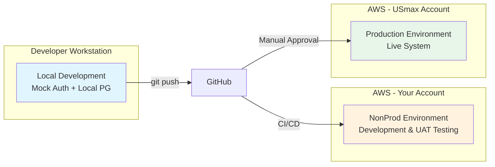

### Environment Comparison

| Aspect | NonProd | Production |
|--------|---------|------------|
| **AWS Account** | Your personal account | USmax account |
| **Purpose** | Development, testing, UAT demos | Live customer-facing system |
| **Availability** | Single-AZ (cost savings) | Multi-AZ (high availability) |
| **Database** | db.t3.micro, single instance | db.t3.small+, Multi-AZ |
| **Compute** | Fargate Spot (1 task) | Fargate On-Demand (2+ tasks) |
| **Backups** | 7-day retention | 30-day + cross-region copy |
| **Monitoring** | Basic CloudWatch | Enhanced + alarms + dashboards |
| **WAF** | Optional/disabled | Enabled with managed rules |
| **Cost Target** | ~$50-80/month | ~$200-400/month |

---

## High-Level Architecture

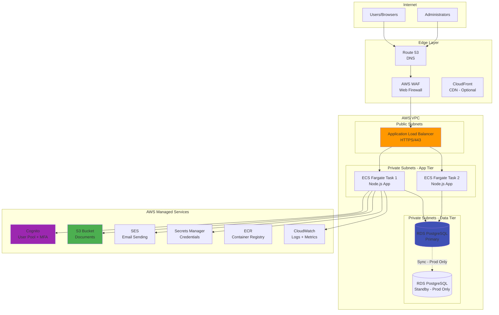

---

## Network Architecture

### VPC Design

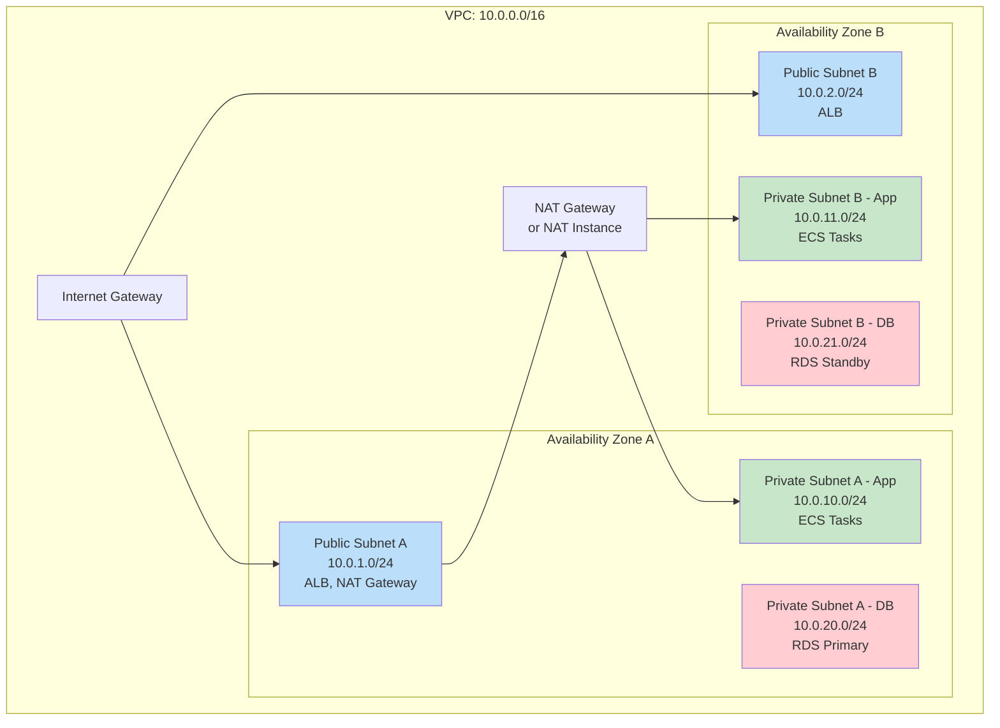

### Subnet Specifications

| Subnet | CIDR | Type | Resources | AZ |
|--------|------|------|-----------|-----|
| public-a | 10.0.1.0/24 | Public | ALB, NAT Gateway | us-east-1a |
| public-b | 10.0.2.0/24 | Public | ALB | us-east-1b |
| private-app-a | 10.0.10.0/24 | Private | ECS Fargate tasks | us-east-1a |
| private-app-b | 10.0.11.0/24 | Private | ECS Fargate tasks | us-east-1b |
| private-db-a | 10.0.20.0/24 | Private | RDS Primary | us-east-1a |
| private-db-b | 10.0.21.0/24 | Private | RDS Standby | us-east-1b |

### Security Groups

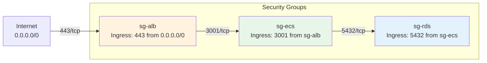

| Security Group | Inbound Rules | Outbound Rules |
|----------------|---------------|----------------|
| `sg-alb` | 443/tcp from 0.0.0.0/0 | All to VPC CIDR |
| `sg-ecs` | 3001/tcp from sg-alb | 443/tcp to 0.0.0.0/0 (AWS APIs), 5432/tcp to sg-rds |
| `sg-rds` | 5432/tcp from sg-ecs | None (stateful response) |

### NAT Strategy

| Environment | NAT Solution | Monthly Cost |
|-------------|--------------|--------------|
| NonProd | NAT Instance (t3.nano) | ~$3-5 |
| Production | NAT Gateway | ~$32-45 |

---

## Compute Architecture

### ECS Fargate Configuration

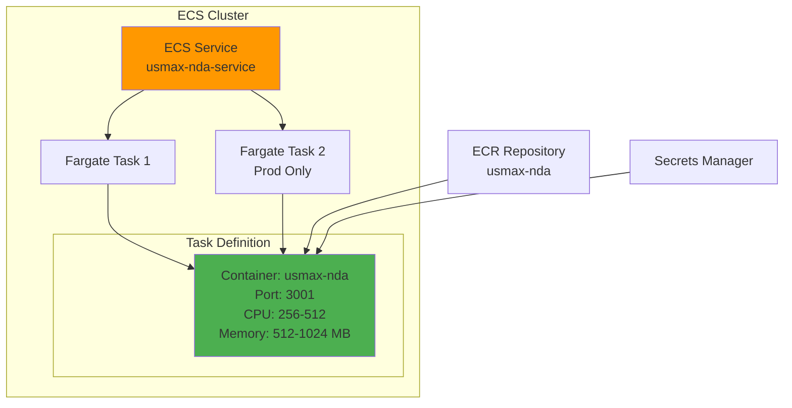

### Task Definition Specifications

| Setting | NonProd | Production |
|---------|---------|------------|
| **CPU** | 256 units (0.25 vCPU) | 512 units (0.5 vCPU) |
| **Memory** | 512 MB | 1024 MB |
| **Desired Count** | 1 | 2 (minimum) |
| **Max Count** | 2 | 6 |
| **Capacity Provider** | FARGATE_SPOT | FARGATE |
| **Health Check Path** | /api/health | /api/health |
| **Health Check Interval** | 30s | 15s |

### Container Specifications

```dockerfile
# Multi-stage Dockerfile (to be created)
FROM node:20-alpine AS builder
# Build frontend (Vite) and backend (TypeScript)

FROM node:20-alpine AS runtime
# Production runtime with compiled assets
EXPOSE 3001
CMD ["node", "dist/server/index.js"]
```

| Container Property | Value |
|--------------------|-------|
| Base Image | node:20-alpine |
| Exposed Port | 3001 |
| Working Directory | /app |
| Node Environment | production |
| User | node (non-root) |

### Auto Scaling Policy (Production Only)

| Metric | Target | Scale Out | Scale In |
|--------|--------|-----------|----------|
| CPU Utilization | 70% | +1 task | -1 task |
| Memory Utilization | 80% | +1 task | -1 task |
| Request Count per Target | 1000/min | +1 task | -1 task |
| Cooldown | - | 60 seconds | 300 seconds |

---

## Database Architecture

### RDS PostgreSQL Configuration

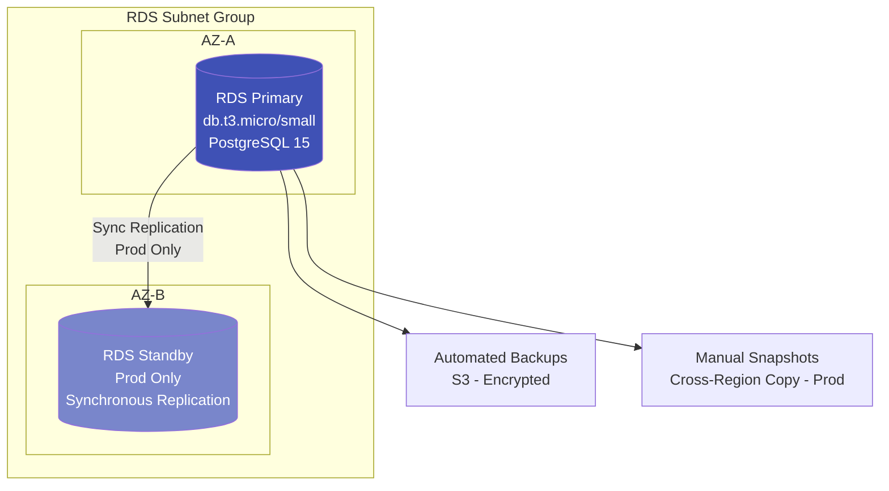

### RDS Specifications

| Setting | NonProd | Production |
|---------|---------|------------|
| **Engine** | PostgreSQL 15.x | PostgreSQL 15.x |
| **Instance Class** | db.t3.micro | db.t3.small (upgradable) |
| **vCPU** | 2 | 2 |
| **Memory** | 1 GB | 2 GB |
| **Storage Type** | gp3 | gp3 |
| **Allocated Storage** | 20 GB | 50 GB |
| **Max Storage (Autoscale)** | 50 GB | 200 GB |
| **Multi-AZ** | No | Yes |
| **Backup Retention** | 7 days | 30 days |
| **Backup Window** | 03:00-04:00 UTC | 03:00-04:00 UTC |
| **Maintenance Window** | Sun 04:00-05:00 UTC | Sun 04:00-05:00 UTC |
| **Deletion Protection** | No | Yes |
| **Performance Insights** | Disabled | Enabled (7 days) |
| **Encryption** | Yes (aws/rds key) | Yes (CMK) |
| **IAM Authentication** | Enabled | Enabled |

### Database Security

| Control | Implementation |
|---------|----------------|
| Network Isolation | Private subnet, sg-rds only allows sg-ecs |
| Encryption at Rest | AES-256, AWS KMS |
| Encryption in Transit | TLS 1.2+ enforced (rds.force_ssl=1) |
| Authentication | IAM DB Auth (no password in app) |
| Credentials | Secrets Manager, auto-rotation 30 days |
| Audit Logging | pgAudit extension enabled |

### Connection Pooling

The application uses PrismaClient with the `@prisma/adapter-pg` adapter which manages connection pooling. Additional configuration:

| Parameter | Value |
|-----------|-------|
| Pool Size | 10 connections |
| Connection Timeout | 30 seconds |
| Idle Timeout | 10 minutes |
| SSL Mode | require |

---

## Storage Architecture

### S3 Bucket Configuration

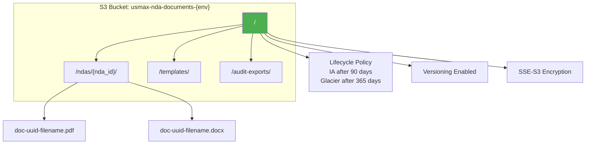

### S3 Bucket Specifications

| Setting | NonProd | Production |
|---------|---------|------------|
| **Bucket Name** | usmax-nda-documents-nonprod | usmax-nda-documents-prod |
| **Versioning** | Enabled | Enabled |
| **Encryption** | SSE-S3 | SSE-KMS (CMK) |
| **Block Public Access** | All blocked | All blocked |
| **Object Lock** | Disabled | Governance mode (optional) |
| **Access Logging** | Disabled | Enabled (to audit bucket) |
| **Cross-Region Replication** | Disabled | Enabled (DR) |

### Lifecycle Rules

| Rule | Transition/Expiration |
|------|----------------------|
| Move to IA | 90 days after creation |
| Move to Glacier | 365 days after creation |
| Delete old versions | 730 days (2 years) |
| Abort incomplete uploads | 7 days |

### S3 Access Pattern

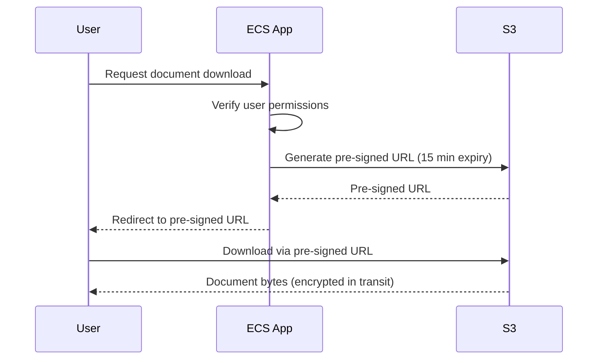

---

## Authentication & Authorization

### Cognito User Pool Configuration

```mermaid
flowchart TB
    subgraph "AWS Cognito"
        UP[User Pool<br/>usmax-nda-{env}]

        subgraph "Authentication Flow"
            INIT[InitiateAuth<br/>USER_PASSWORD_AUTH]
            MFA[MFA Challenge<br/>SOFTWARE_TOKEN_MFA]
            TOKENS[JWT Tokens<br/>Access + ID + Refresh]
        end

        CLIENT[App Client<br/>SPA - No Secret]
    end

    UP --> CLIENT
    CLIENT --> INIT
    INIT --> MFA
    MFA --> TOKENS

    style UP fill:#9c27b0,color:#fff
    style MFA fill:#e91e63,color:#fff
```

### Cognito Specifications

| Setting | Value |
|---------|-------|
| **User Pool Name** | usmax-nda-{env} |
| **MFA** | Required (SOFTWARE_TOKEN_MFA) |
| **Password Policy** | 12+ chars, upper, lower, number, symbol |
| **Account Recovery** | Email only |
| **Email Verification** | Required |
| **Username Attributes** | Email |
| **Advanced Security** | Enforced mode |
| **Token Validity - Access** | 4 hours |
| **Token Validity - Refresh** | 30 days |
| **Token Validity - ID** | 4 hours |
| **Prevent User Existence Errors** | Enabled |

### Authorization Flow

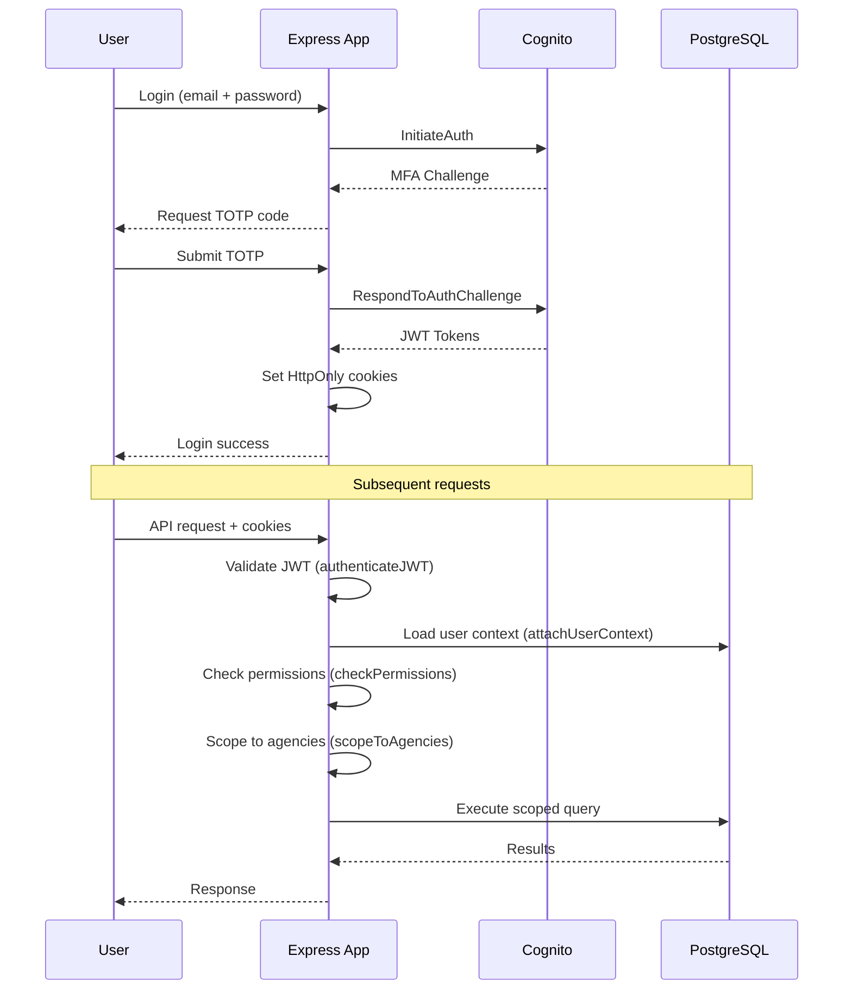

---

## Email Services

### SES Configuration

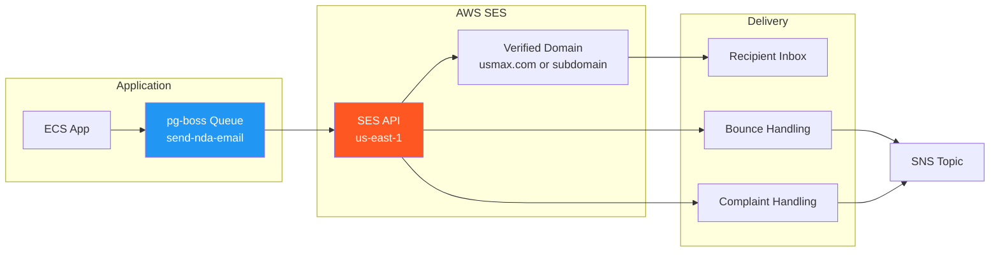

### SES Specifications

| Setting | NonProd | Production |
|---------|---------|------------|
| **Sending Mode** | Sandbox (limited) | Production (requested) |
| **Verified Identity** | Email address | Domain (usmax.com) |
| **DKIM** | Enabled | Enabled |
| **SPF** | Configured | Configured |
| **DMARC** | p=none | p=quarantine |
| **Sending Quota** | 200/day (sandbox) | 50,000/day (to be requested) |
| **Configuration Set** | usmax-nda-nonprod | usmax-nda-prod |
| **Bounce Handling** | Log to CloudWatch | SNS → Lambda → Update DB |
| **Complaint Handling** | Log to CloudWatch | SNS → Lambda → Alert |

### Email Queue (pg-boss)

| Setting | Value |
|---------|-------|
| Queue Name | send-nda-email |
| Retry Attempts | 3 |
| Retry Delay | Exponential (10s, 30s, 90s) |
| Job Timeout | 60 seconds |
| Retention | 30 days (completed jobs) |

---

## Monitoring & Observability

### CloudWatch Architecture

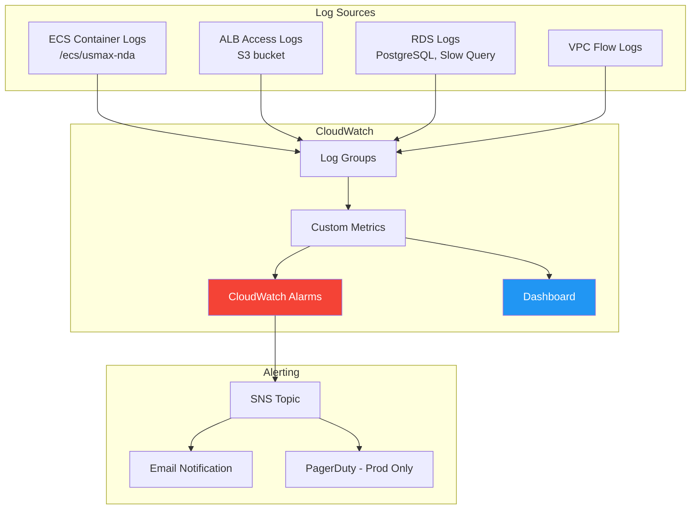

### CloudWatch Alarms

| Alarm | Metric | Threshold | Action |
|-------|--------|-----------|--------|
| High CPU | ECS CPUUtilization | > 80% for 5 min | SNS notification |
| High Memory | ECS MemoryUtilization | > 85% for 5 min | SNS notification |
| 5xx Errors | ALB HTTPCode_Target_5XX | > 10 in 5 min | SNS notification |
| Database Connections | RDS DatabaseConnections | > 80% max | SNS notification |
| Database CPU | RDS CPUUtilization | > 80% for 10 min | SNS notification |
| Free Storage | RDS FreeStorageSpace | < 5 GB | SNS notification |
| Unhealthy Targets | ALB UnHealthyHostCount | > 0 for 5 min | SNS notification |
| Email Bounce Rate | Custom | > 5% | SNS notification |

### Log Retention

| Log Group | NonProd | Production |
|-----------|---------|------------|
| /ecs/usmax-nda | 7 days | 90 days |
| /aws/rds/usmax-nda | 7 days | 90 days |
| /vpc/flowlogs | 3 days | 30 days |
| /aws/alb/usmax-nda | 7 days | 90 days |

### Application Metrics (Custom)

| Metric | Description |
|--------|-------------|
| nda.created | Count of NDAs created |
| nda.email_sent | Count of emails sent |
| nda.document_generated | Count of documents generated |
| auth.login_success | Successful logins |
| auth.login_failure | Failed login attempts |
| auth.mfa_challenge | MFA challenges issued |

---

## Security Architecture

### Defense in Depth

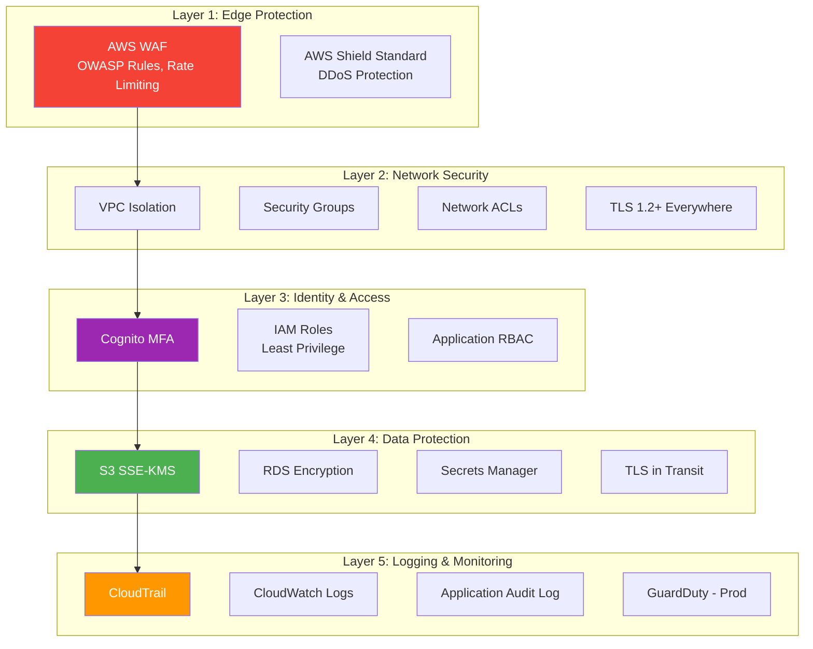

### Security Controls Mapping (CMMC Level 1)

| CMMC Practice | Implementation |
|---------------|----------------|
| AC.1.001 - Limit system access | Cognito MFA, RBAC, agency scoping |
| AC.1.002 - Limit transaction types | Permission-based access control |
| AC.1.003 - Verify and control connections | VPC, Security Groups, TLS |
| AC.1.004 - Control public information | No public S3, private subnets |
| IA.1.076 - Identify users | Cognito User Pool, email verification |
| IA.1.077 - Authenticate users | MFA required, password policy |
| MP.1.118 - Sanitize media | S3 lifecycle policies, secure delete |
| PE.1.131 - Limit physical access | AWS manages physical security |
| SC.1.175 - Monitor communications | VPC Flow Logs, CloudWatch |
| SC.1.176 - Control public-facing systems | ALB + WAF, private app tier |
| SI.1.210 - Identify/report flaws | Sentry, CloudWatch Alarms |
| SI.1.211 - Update malicious code | Container scanning (ECR) |
| SI.1.212 - Update protection | Automated patching, managed services |
| SI.1.213 - Periodic scans | AWS Inspector (optional) |

### IAM Role Structure

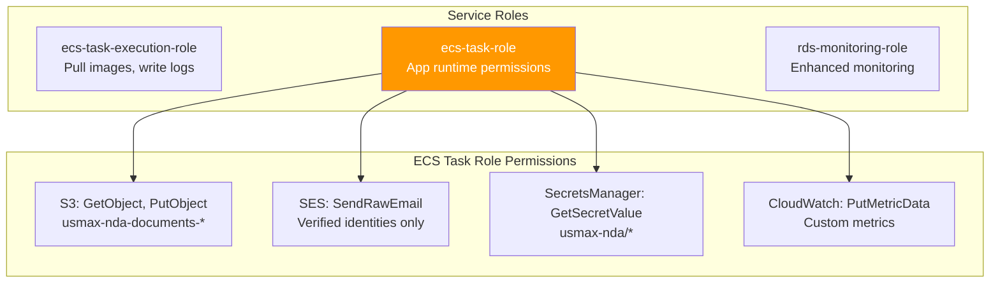

### WAF Rules (Production)

| Rule | Description | Action |
|------|-------------|--------|
| AWSManagedRulesCommonRuleSet | Common vulnerabilities (XSS, SQLi) | Block |
| AWSManagedRulesKnownBadInputsRuleSet | Known malicious inputs | Block |
| Rate Limit | 2000 requests/5 min per IP | Block |
| Geo Restriction | US only (optional) | Allow US, block others |

---

## CI/CD Pipeline

### GitHub Actions Workflow

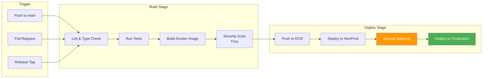

### Workflow Files

| Workflow | Trigger | Purpose |
|----------|---------|---------|
| ci.yml | Push, PR | Lint, test, type check |
| build.yml | Push to main | Build and push Docker image |
| deploy-nonprod.yml | Push to main | Auto-deploy to nonprod |
| deploy-prod.yml | Release tag | Deploy to prod (manual approval) |
| db-migrate.yml | Manual | Run database migrations |

### Deployment Strategy

| Environment | Strategy | Rollback |
|-------------|----------|----------|
| NonProd | Rolling update | Manual |
| Production | Blue/Green (ECS) | Automatic on health check failure |

---

## Cost Estimates

> **Note:** These estimates reflect **base infrastructure costs only** — the fixed hourly/monthly charges for running the services, assuming near-zero traffic and minimal storage. Actual costs may vary slightly based on region (us-east-1 assumed).

### NonProd Environment (Monthly) — Base Costs

| Service | Configuration | Hourly Rate | Monthly Base Cost |
|---------|---------------|-------------|-------------------|
| **ECS Fargate** | 1 task, 0.25 vCPU, 512 MB, **Spot** | ~$0.004 | **$3.00** |
| **RDS PostgreSQL** | db.t3.micro, 20 GB gp3, single-AZ | $0.017 + storage | **$15.00** |
| **NAT Instance** | t3.nano (instead of NAT Gateway) | $0.0052 | **$3.80** |
| **Application Load Balancer** | 1 ALB (base charge, no LCUs) | $0.0225 | **$16.43** |
| **S3** | <1 GB storage | $0.023/GB | **$0.02** |
| **ECR** | ~500 MB images | $0.10/GB | **$0.05** |
| **CloudWatch Logs** | Minimal ingestion, 7-day retention | per GB ingested | **$0.50** |
| **Secrets Manager** | 5 secrets | $0.40/secret | **$2.00** |
| **Route 53** | 1 hosted zone | $0.50/zone | **$0.50** |
| **Cognito** | <50K MAU (free tier) | $0 | **$0.00** |
| **SES** | Sandbox mode | $0 | **$0.00** |
| **Data Transfer** | Negligible | — | **$0.00** |
| | | | |
| **TOTAL** | | | **~$41/month** |

### Production Environment (Monthly) — Base Costs

| Service | Configuration | Hourly Rate | Monthly Base Cost |
|---------|---------------|-------------|-------------------|
| **ECS Fargate** | 2 tasks, 0.5 vCPU, 1 GB each, On-Demand | $0.031/task | **$45.00** |
| **RDS PostgreSQL** | db.t3.small, 50 GB gp3, **Multi-AZ** | $0.034 × 2 | **$52.00** |
| **NAT Gateway** | 1 NAT Gateway (base charge only) | $0.045 | **$32.85** |
| **Application Load Balancer** | 1 ALB (base charge, no LCUs) | $0.0225 | **$16.43** |
| **S3** | ~10 GB storage | $0.023/GB | **$0.23** |
| **ECR** | ~1 GB images | $0.10/GB | **$0.10** |
| **CloudWatch Logs** | Minimal ingestion, 90-day retention | per GB ingested | **$1.00** |
| **Secrets Manager** | 5 secrets | $0.40/secret | **$2.00** |
| **Route 53** | 1 hosted zone | $0.50/zone | **$0.50** |
| **Cognito** | <50K MAU (free tier) | $0 | **$0.00** |
| **SES** | Production (verified domain) | $0 base | **$0.00** |
| **WAF** | 1 Web ACL + 3 managed rule groups | $5 + $3×3 | **$14.00** |
| **Data Transfer** | Negligible | — | **$0.00** |
| | | | |
| **TOTAL** | | | **~$164/month** |

### Cost Breakdown Visualization

```
NonProd (~$41/mo)                    Production (~$164/mo)
━━━━━━━━━━━━━━━━━━━━━━━━━━━━━━━━━   ━━━━━━━━━━━━━━━━━━━━━━━━━━━━━━━━━
ALB          ████████████ $16.43    RDS (M-AZ)  ████████████████ $52.00
RDS          ███████████  $15.00    Fargate     ██████████████   $45.00
NAT Instance ███          $3.80     NAT Gateway ██████████       $32.85
Fargate Spot ██           $3.00     ALB         █████            $16.43
Other        ██           $3.00     WAF         ████             $14.00
                                    Other       █                $3.83
```

### Why These Costs Are Fixed

| Service | Fixed Component | Variable Component (near-zero for us) |
|---------|-----------------|---------------------------------------|
| ALB | $16.43/mo base | LCU charges based on connections/bandwidth |
| NAT Gateway | $32.85/mo base | $0.045/GB data processed |
| RDS | Hourly instance + storage | IOPS, snapshots beyond retention |
| Fargate | vCPU-hour + GB-hour | Only pay for running tasks |
| S3 | $0.023/GB stored | PUT/GET requests, data transfer |
| CloudWatch | — | Per-GB log ingestion ($0.50/GB) |

### Cost Optimization Already Applied

| Optimization | NonProd | Production | Savings |
|--------------|---------|------------|---------|
| NAT Instance vs Gateway | ✅ $3.80 | ❌ $32.85 | $29/mo in nonprod |
| Fargate Spot | ✅ ~70% off | ❌ On-Demand | $6/mo in nonprod |
| Single-AZ RDS | ✅ | ❌ Multi-AZ | $26/mo in nonprod |
| WAF disabled | ✅ | ❌ Enabled | $14/mo in nonprod |

### Future Savings Opportunities

| Optimization | Potential Savings | When to Apply |
|--------------|-------------------|---------------|
| RDS Reserved Instance (1-yr) | ~35% on RDS ($18/mo prod) | After stable for 6+ months |
| Fargate Savings Plan (1-yr) | ~20% on Fargate ($9/mo prod) | After usage patterns known |
| Scheduled scaling (night off) | ~50% on Fargate | If 24/7 not required |

---

## Implementation Roadmap

### Phase 1: Foundation (Prerequisites)

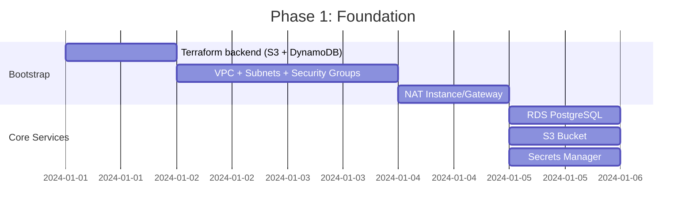

**Deliverables:**
1. Terraform state backend configured
2. VPC with public/private subnets
3. RDS PostgreSQL running with initial schema
4. S3 bucket for documents
5. Secrets stored in Secrets Manager

### Phase 2: Application Deployment

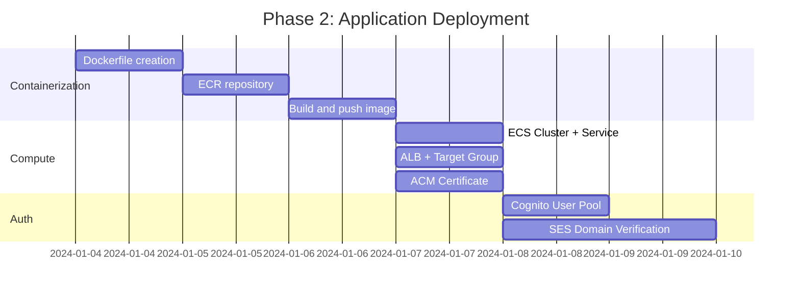

**Deliverables:**
1. Docker image in ECR
2. ECS service running
3. ALB with HTTPS
4. Cognito user pool configured
5. SES verified for sending

### Phase 3: Security & Monitoring

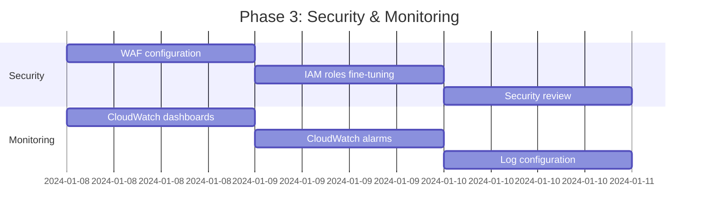

**Deliverables:**
1. WAF rules active
2. Least-privilege IAM policies
3. CloudWatch dashboard
4. Alerting configured

### Phase 4: CI/CD & Production

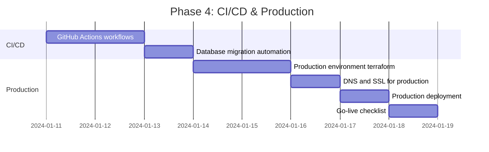

**Deliverables:**
1. Automated CI/CD pipeline
2. Production environment deployed
3. Go-live documentation

---

## Appendix A: Terraform Module Structure

```
infrastructure/
├── README.md
├── backend-bootstrap/           # One-time setup
│   ├── main.tf
│   ├── variables.tf
│   └── outputs.tf
├── modules/
│   ├── vpc/
│   │   ├── main.tf
│   │   ├── variables.tf
│   │   ├── outputs.tf
│   │   └── nat-instance.tf
│   ├── rds/
│   │   ├── main.tf
│   │   ├── variables.tf
│   │   └── outputs.tf
│   ├── ecs/
│   │   ├── main.tf
│   │   ├── task-definition.tf
│   │   ├── service.tf
│   │   ├── variables.tf
│   │   └── outputs.tf
│   ├── alb/
│   │   ├── main.tf
│   │   ├── variables.tf
│   │   └── outputs.tf
│   ├── s3/
│   │   ├── main.tf
│   │   ├── variables.tf
│   │   └── outputs.tf
│   ├── cognito/                 # Move existing cognito.tf here
│   │   ├── main.tf
│   │   ├── variables.tf
│   │   └── outputs.tf
│   ├── ses/
│   │   ├── main.tf
│   │   ├── variables.tf
│   │   └── outputs.tf
│   ├── iam/
│   │   ├── main.tf
│   │   ├── ecs-roles.tf
│   │   ├── variables.tf
│   │   └── outputs.tf
│   ├── cloudwatch/
│   │   ├── main.tf
│   │   ├── alarms.tf
│   │   ├── dashboard.tf
│   │   ├── variables.tf
│   │   └── outputs.tf
│   ├── secrets/
│   │   ├── main.tf
│   │   ├── variables.tf
│   │   └── outputs.tf
│   └── waf/
│       ├── main.tf
│       ├── variables.tf
│       └── outputs.tf
└── environments/
    ├── nonprod/
    │   ├── main.tf
    │   ├── variables.tf
    │   ├── terraform.tfvars
    │   ├── backend.tf
    │   └── outputs.tf
    └── prod/
        ├── main.tf
        ├── variables.tf
        ├── terraform.tfvars
        ├── backend.tf
        └── outputs.tf
```

---

## Appendix B: Environment Variables

### Application Environment Variables

| Variable | Description | Source |
|----------|-------------|--------|
| `NODE_ENV` | production | Hardcoded in task definition |
| `PORT` | 3001 | Hardcoded in task definition |
| `DATABASE_URL` | PostgreSQL connection string | Secrets Manager |
| `COGNITO_USER_POOL_ID` | Cognito User Pool ID | Secrets Manager |
| `COGNITO_APP_CLIENT_ID` | Cognito App Client ID | Secrets Manager |
| `COGNITO_REGION` | us-east-1 | Hardcoded |
| `AWS_REGION` | us-east-1 | ECS metadata |
| `S3_BUCKET_NAME` | usmax-nda-documents-{env} | Environment variable |
| `SES_FROM_EMAIL` | nda@usmax.com | Secrets Manager |
| `SENTRY_DSN` | Sentry DSN (optional) | Secrets Manager |
| `FRONTEND_URL` | https://nda.usmax.com | Environment variable |

---

## Appendix C: DNS and SSL

### Domain Structure

| Domain | Environment | Purpose |
|--------|-------------|---------|
| nda-dev.yoursite.com | NonProd | Development testing |
| nda.usmax.com | Production | Customer-facing |

### SSL Certificate

- **Provider:** AWS Certificate Manager (ACM)
- **Validation:** DNS validation (auto-renewal)
- **Coverage:** Apex + wildcard (*.domain.com)

---

## Document Approval

| Role | Name | Date | Signature |
|------|------|------|-----------|
| Author | | | |
| Technical Reviewer | | | |
| Security Reviewer | | | |
| Project Owner | Jonah | | |
